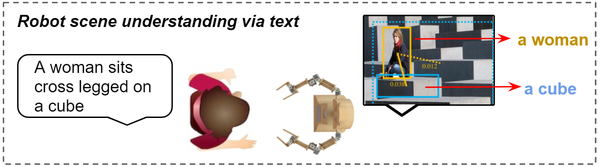

# Natural-Language-Processing
This is the project repo for NLP course 2020 fall. Project topic: Robot Scene Understanding using Referring Relationship

## Dataset:
The dataset has 14 columns and the fieldnames = ['ImageID', 'LabelName1', 'LabelName2','Height', 'Width', 
'XMin1','XMax1', 'YMin1', 'YMax1', 'XMin2', 'XMax2', 'YMin2', 'YMax2', 'ReferringExpression']

which annotated the bounding boxes and the relationship between two objects in the image.
The synthetic dataset is created by using 3 different datasets with image/text augmentation.

1. Visual 7W (QA + BB -> VRE) -[Xiao Liu & Zijie]
   dataset address: http://ai.stanford.edu/~yukez/visual7w/
   - **Xiao**:
   This dataset is a Q&A dataset with bounding boxes included. The text augmentation is done by combining the 
   answer and the question, which resulted in a statement of the relationship between two objects in the image.
   QA pairs with only 2 objects involved are selected for our dataset creation. Xiao worked on combining "what" questions. i.e., with a QA pair Q-"What is on the plate?" A-"Pizza.", the referring expression is "Pizza is on the plate". For running the code, you will need two json file provided by the dataset and the images.
   code-> https://github.com/liuxiao1468/Natural-Language-Processing/blob/main/Code_dataset/Xiao_prep_data.py
   - **Zijie**: The visual_7w is a VQA task dataset, with annotated bounding boxes for objects decribed in both texts and images.
   For our task, we want to convert the question-answering pairs into text desriptions for corresponding images respectively, just like
   'who is holding the tennis racket', 'the tennis player' to 'the tennis player is holding the tennis racket' and the objects here are player and tennis racket
   In this part, only question type who is used to generate the samples. code->https://github.com/liuxiao1468/Natural-Language-Processing/blob/main/Code_dataset/Zijie_utils.py
2. Visual Genome - [Ziming]
   dataset address: https://visualgenome.org/
   - **Ziming**: There are three ipynb files, the "example_image_augmentation.ipynb" and "example_word_augmentation.ipynb" shows that I used different APIs to do the image augmentation and annotation augmentation work. After I clear the best API to do the data augmentation work, I used them to create the new dataset in "final_data_creation.ipynb". code->https://github.com/liuxiao1468/Natural-Language-Processing/tree/main/Code_dataset/ZimingDong_code_readme Those APIs are: "visual_genome", "imgaug", "nlpaug". 
   For the new image creation, I create about 2700 images with using imgaug API, visual_genome API provided all iamges and annotation function, so I extract images and text information without downloading them. For the first 500 images, I flip the original image horizontally. For the 500th-1000th image, I flip the original image horizontally and add additiveGaussianNoise to get new images. For the 1000th-1500th images I use AddtoHue augmentor to augment the original image. For the 1500th-2000th images, I use both flip and AddtoHue augmentors to create new images. For the 2000th-2700th images, I use flip, AddtoHue and additiveGaussianNoise augmentor to create those new images.
For the relationship augmentation work, I use nlpaug API and the "relationship_aliases.txt" to create new expression of relationship between objects. Becasue I partition the datasets for several parts, I randomly use nlpaug augmenter to recreate the relationship, such as nlpaug.augmenter.char, nlpaug.augmenter.word, and nlpaug.augmenter.sentence or the relationship_aliases.txt file to replace the old relationship to the new one based on the synonyms words.
  Instruction of API environment/packages:
   1.To run the code files, attched github links give instruction of downloading the dependeces/packages for "visual_genome", "imgaug", "nlpaug". 
   2.visual_genome: https://github.com/ranjaykrishna/visual_genome_python_driver
   3.imgaug: https://github.com/aleju/imgaug
   4.nlpaug: https://github.com/makcedward/nlpaug
3. Visual Madlibs - [Alex]
   dataset address: http://tamaraberg.com/visualmadlibs/download.html (Version 1)
   - **Alex**: For this portion, I leveraged the Visual Madlibs (https://arxiv.org/abs/1506.00278) dataset and pycocotools to generate referring expressions for our project. The script written accesses the Visual Madlibs dataset, which includes a set of JSON files that annotate the various persons and objects in a set of images, based on attribute, locations, activities, locations, and more. The annotations were originally gathered from human users completing various "fill-in-the-blank" tasks. The prompts (consisting of a "person" and "object") and human-provided relationship descriptions were extracted from the pair-relationships annotations, then concatenated to form a complete referring expression describing a relationship present in an image. The images used in the Visual Madlibs project come from the MSCOCO image database, so the pycocotools API was used to retrieve the corresponding image metadata and bounding boxes for the objects. To further enhance the referring expressions, I created rules to look for descriptions of the image subjects' gender, appearance, location, and other attributes from other annotation files, and added or substituted them into the expressions. For example, from the person-attributes annotations, if an attribute contained the word "man", "woman", "girl", or "boy", that word would be substituted in for the generic default label of "person". Furthermore, if an attribute contained the experession "wearing" or "dressed in," it was appended to the person's label. Similar logic was implemented for the object attributes and positions. This created final referring expressions that had richer and more precise descriptions for training.
To run this dataset creation script: 1) It is required to have installed the pycocotools api, the COCO validation instances and images from MSCOCO site (http://mscoco.org/dataset/#download), and the  madlibs_train_v1 folder from the dataset download. 2) You must have the python dependencies: python3, skimage, pycocotools (https://pypi.org/project/pycocotools/) 3) Before running the script, the user needs to update the paths in the script to the locations of the COCO validation images and instances folder, the madlibs_train folder, and the desired output location. code-> https://github.com/liuxiao1468/Natural-Language-Processing/blob/main/Code_dataset/alex_dataset_creation.py
