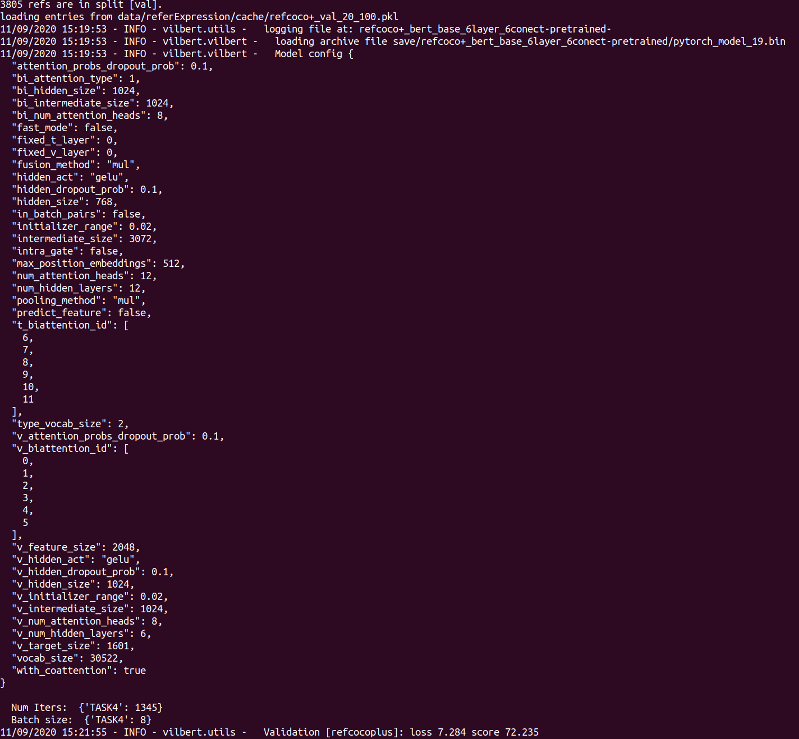
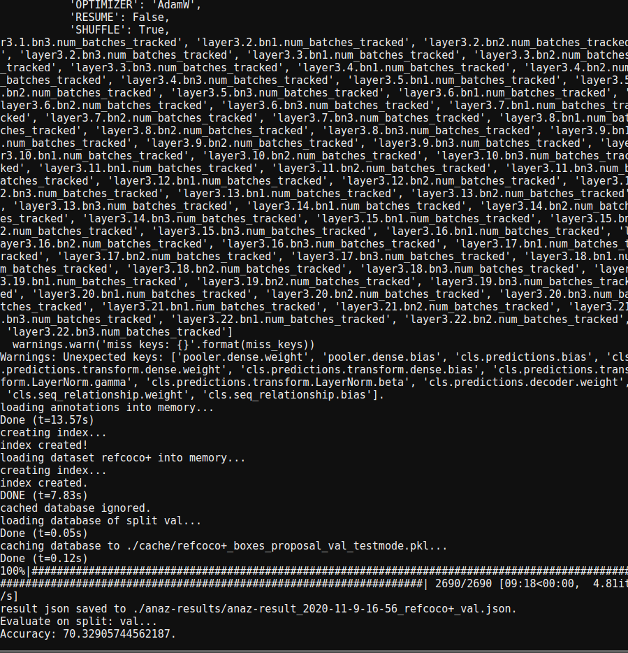
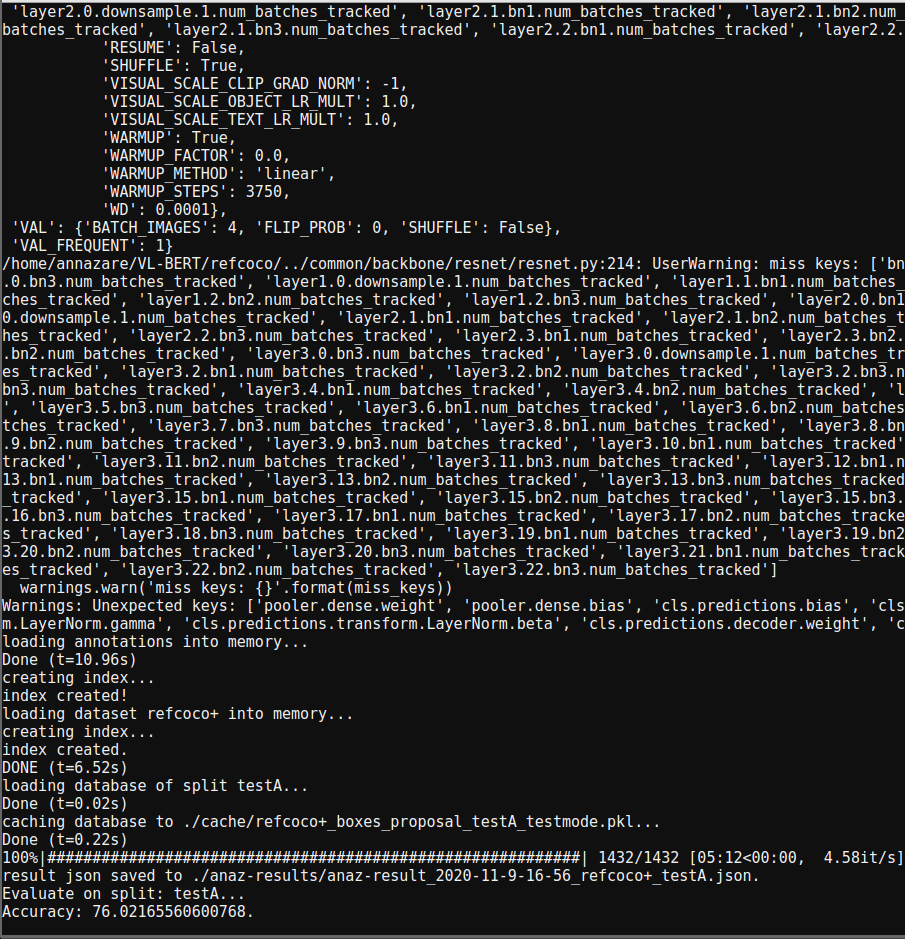
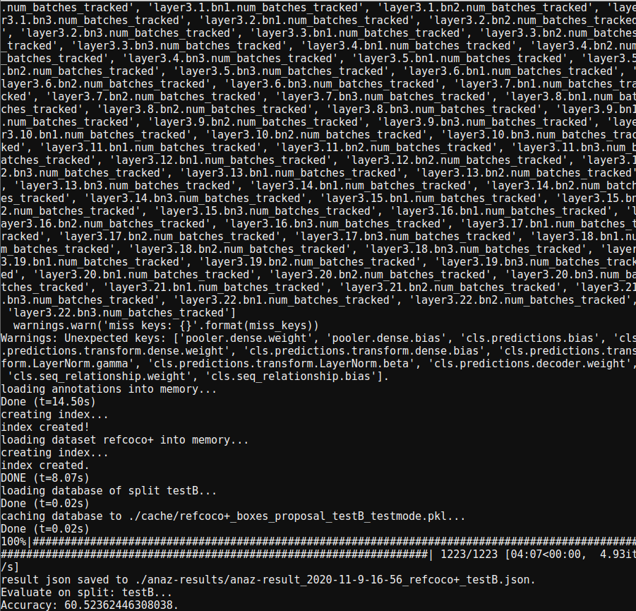

# Natural-Language-Processing
This is the readme for phase1 submission. Project topic: Robot Scene Understanding using Referring Relationship

Model:

## Dataset setup
* COCO 2014 Train/2014 Val/2014 Test Images and 2014 Train/Val annotations: [https://cocodataset.org/#download](https://cocodataset.org/#download)
RefCOCO+ annotations: http://bvisionweb1.cs.unc.edu/licheng/referit/data/refcoco+.zip
RefCOCO+ region proposals: http://bvision.cs.unc.edu/licheng/MattNet/detections.zip 

## 1. Vil-Bert model
   model address: https://github.com/jiasenlu/vilbert_beta
   - **Xiao & Ziming**:
### Environment Setup
   * We used a conda env for installing the vil-Bert model and pytorch with other deeplearning packages:
```
conda create -n vilbert python=3.6
conda activate vilbert
git clone https://github.com/jiasenlu/vilbert_beta
cd vilbert_beta
pip install -r requirements.txt
conda install pytorch torchvision cudatoolkit=10.0 -c pytorch
cd tools/refer
make
```
* For using a pretrained model with 6-Layer vil-Bert, simply go to https://drive.google.com/drive/folders/1GWY2fEbZCYHkcnxd0oysU0olfPdzcD3l and save the downloaded model under `~/vilbert_beta/save`. 
* For using refercoco dataset, download from the dropbox: https://www.dropbox.com/sh/4jqadcfkai68yoe/AADHI6dKviFcraeCMdjiaDENa?dl=0 and move the unzipped file `referExpression` folder to `~/vilbert_beta/data`. The default pytorch dataloader is used to load the Downstream tasks, raw data need to be converted to the `tsv` file to `lmdb`. 
### Evaluation
* Since re-training model on refercoco+ took too much time, we simply did a validation on a split refercoco+ dataset, `3085` images are used for validation. Here is the command:
```
python eval_tasks.py --bert_model bert-base-uncased --from_pretrained save/refcoco+_bert_base_6layer_6conect-pretrained/pytorch_model_19.bin --config_file config/bert_base_6layer_6conect.json --task 4
```
### Current Results
The script resulted in the loss and validation score.



## 2. VL-Bert model
   model address: https://github.com/jackroos/VL-BERT
   - **Alex & Zijie**: 
* From  [Referring Expression Comprehension: A Survey of Methods and Datasets](https://arxiv.org/pdf/2007.09554.pdf), we selected VL-BERT as one of two models to try and run for our selected project task. VL-BERT was created by Weijie Su1 , Xizhou Zhu , Yue Cao , Bin Li , Lewei Lu, Furu Wei2, and Jifeng Dai, and currently is the top-performing system on the RefCOCO+ task. The paper can be found [here](https://arxiv.org/abs/1908.08530). The implementation is available [here](https://github.com/jackroos/VL-BERT).

* The structure of the code is broken up into separate python scripts for training and testing or various downstream tasks (VCR, VQA, RefCOCO+). For RefCOCO+. the training is called in either a distributed or non-distributed command, which kicks off the end-to-end process, starting from parsing the commandline and configured arguments. The internal training function is then called, and the pre-trained model checkpoint is loaded using pytorch, and trained for a maximum of 20 epochs using a common trainer for all downstream tasks. After each epoch, the updated weights are saved in a checkpoint file, and the best-performing model at that point is saved as the "best" model in the checkpoint directory. When the evaluation command is used, a test script is run, which parses the passed and configured arguments, then loads the model with pytorch, passes the test data through in eval mode to produce the predicted bounding boxes, and compares them to the groundtruth boxes using the IOU protocol to calculate the accuracy. 

### Data and Pre-trained model setup
* The VL-BERT model was pre-trained on the Conceptual Captions dataset, with only text data. In order to use the model for the RefCOCO+ task, we downloaded the following fine-tuning and evaluation with image data, and placed them in the appropriate directories per the author's instructions: 
* COCO 2014 Train/2014 Val/2014 Test Images and 2014 Train/Val annotations: [https://cocodataset.org/#download](https://cocodataset.org/#download)
RefCOCO+ annotations: http://bvisionweb1.cs.unc.edu/licheng/referit/data/refcoco+.zip
RefCOCO+ region proposals: http://bvision.cs.unc.edu/licheng/MattNet/detections.zip 
* We also retrieved the pre-trained models from the links at [https://github.com/jackroos/VL-BERT/blob/master/model/pretrained_model/PREPARE_PRETRAINED_MODELS.md](https://github.com/jackroos/VL-BERT/blob/master/model/pretrained_model/PREPARE_PRETRAINED_MODELS.md).


### Environment Setup
* We used anaconda to manage our package installations and setups:
```
conda create -n vl-bert python=3.6 pip
conda activate vl-bert
conda install pytorch=1.1.0 cudatoolkit=9.0 -c pytorch
pip install Cython
pip install -r requirements.txt
```
### Fine-tuning
* We practiced fine-tuning of the pretrained model on both distributed and non-distributed setups, but due to resource constraints, we focused on using the non-distributed method. To compile the scripts, from root directory call:
```
./scripts/init.sh
```
* To fine-tune the pretrained VL-BERT base of the model on the RefCOCO+ task (generic command): First, update the config file with the correct GPU indexes and desired batch size at ./cfgs/refcoco/base_detected_regions_4x16G.yaml
Then run the command:
```
./scripts/nondist_run.sh <task>/train_end2end.py <path_to_cfg> <dir_to_store_checkpoint>
```
For our specific setup, the actual command was:
```
./scripts/nondist_run.sh refcoco/train_end2end.py ./cfgs/refcoco/base_detected_regions_4x16G.yaml ./checkpoints/
```
### Evaluation
* After training, evaluate on the validation set using:
```
python refcoco/test.py \
  --split <val|testA|testB> \
  --cfg <cfg_file> \
  --ckpt <checkpoint> \
  --gpus <indexes_of_gpus_to_use> \
  --result-path <dir_to_save_result> --result-name <result_file_name>
```
* Our usage, val split:
```
python refcoco/test.py \
--split val \
--cfg ./cfgs/refcoco/base_detected_regions_4x16G_2.yaml \
--ckpt ./checkpoints_2/output/vl-bert/refcoco+/base_detected_regions_4x16G_2/train_train/vl-bert_base_res101_refcoco-best.model \
--gpus 0 \
--result-path ./anaz-results/ 
--result-name anaz-result_2020-11-9-16-56
```
testA split:
```
python refcoco/test.py \
--split testA \
--cfg ./cfgs/refcoco/base_detected_regions_4x16G_2.yaml \
--ckpt ./checkpoints_2/output/vl-bert/refcoco+/base_detected_regions_4x16G_2/train_train/vl-bert_base_res101_refcoco-best.model \
--gpus 0 \
--result-path ./anaz-results/ 
--result-name anaz-result_2020-11-9-16-56
```
testB split:
```
python refcoco/test.py \
--split testB \
--cfg ./cfgs/refcoco/base_detected_regions_4x16G_2.yaml \
--ckpt ./checkpoints_2/output/vl-bert/refcoco+/base_detected_regions_4x16G_2/train_train/vl-bert_base_res101_refcoco-best.model \
--gpus 0 \
--result-path ./anaz-results/ 
--result-name anaz-result_2020-11-9-16-56
```  
### Current Results
* After running the fine-tuning script for 24 hours on a single machine (6 epochs), we present our most recent results:

| Split    | Accuracy          |
|----------|-------------------|
|val       |70.32905744562187  |
|testA     |76.02165560600768  |
|testB     |60.52362446308038  |






